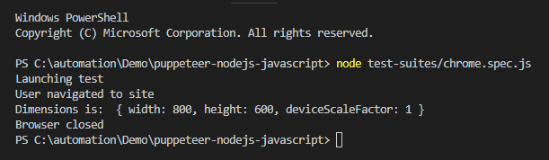

# Puppeteer, NodeJS and Javascript Setup Guide
This is sample Test Automation framework designed using Puppeteer, NodeJS and Javascript.

## To Get Started

### Pre-requisites
* Download and install Node.js:
  * [Install Node.JS](https://qaloop.tk/blog/2018/11/23/install-node-js/ "Install Node.JS")
* Optional - Download and install any Text Editor like Visual Code/Sublime/Brackets
  * [Install Visual Studio Code](https://qaloop.tk/blog/2018/11/23/install-visual-studio-code/ "Install Visual Studio Code")

### Setup Scripts 
* Clone the repository into a folder
* Go to Project root directory and install Dependency: `npm install`
* All the dependencies from package.json and ambient typings would be installed in node_modules folder.

### How to Run Test
* Run complete Test Suite: `node test-suites/chrome.spec.js`

### How to Update local npm packages
* Go to Project root directory and run command: `npm update`

### Sample Test Results

## [Step by Step installation instruction for Beginners](https://qaloop.tk/blog/2018/12/19/test-automation-using-puppeteer-nodejs-javascript/ "Step by Step installation instruction for Beginners")

## Visit my [Blog](https://qaloop.tk/blog/ "Blog")
